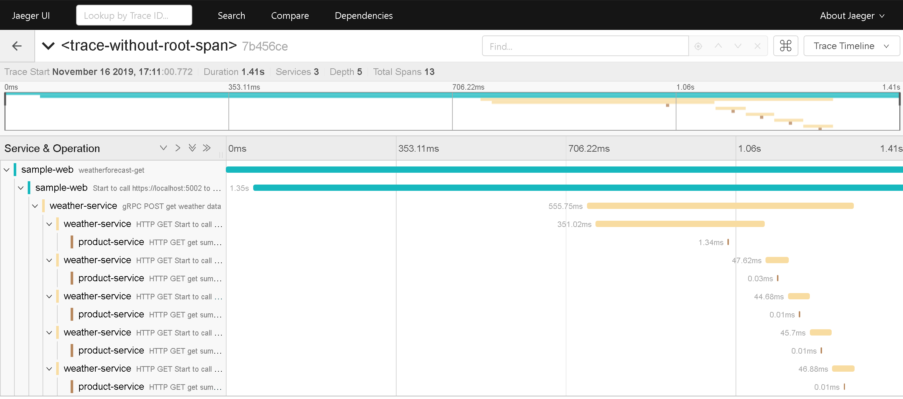
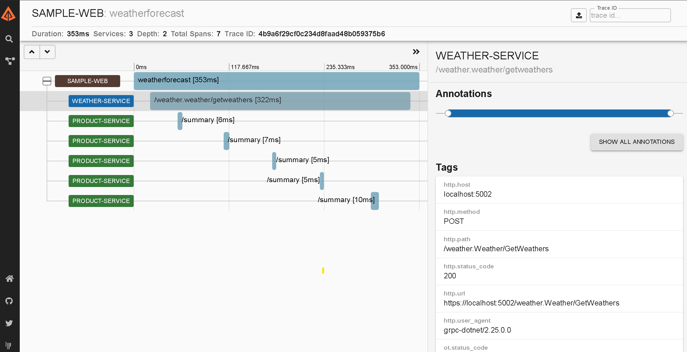
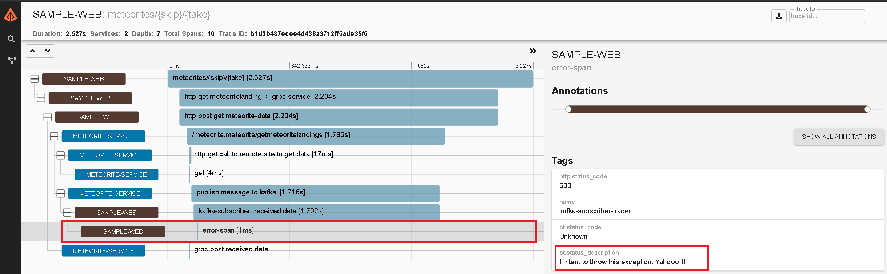
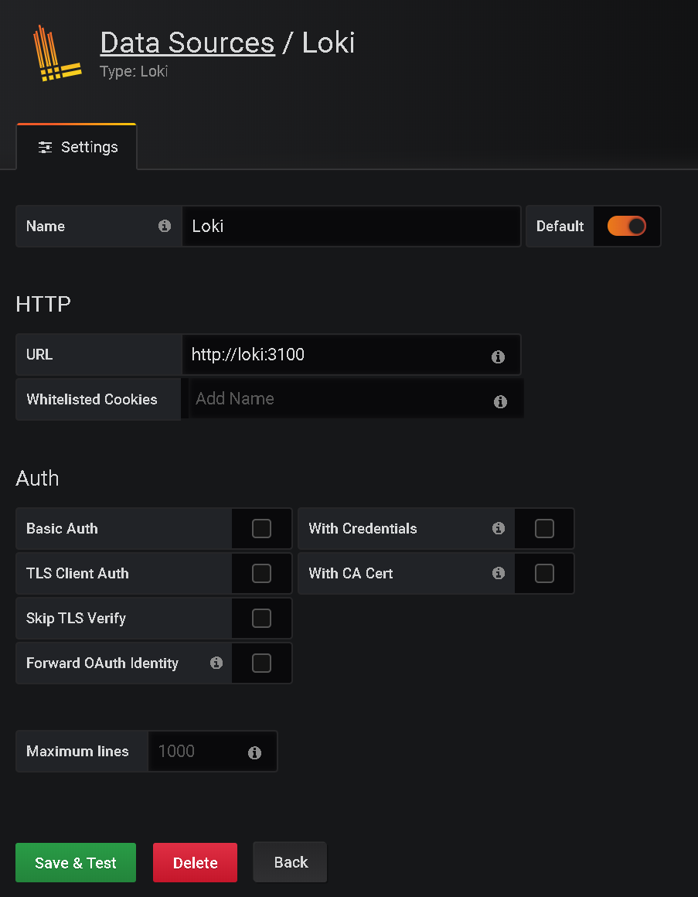
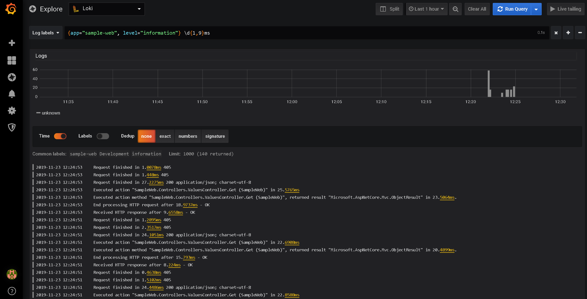
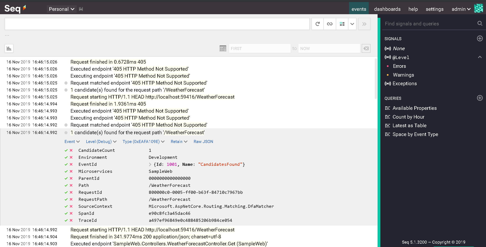

# Opentelemetry Experiment with .NET Core 3.x

[](http://opentelemetry.io)

This is a demo to show how to use OpenTelemetry for tracing on multiple services with multi-protocols on .NET Core 3.x

# Demo scenario

1. SampleWeb (REST) - http://localhost:5000
2. WeatherService (gRPC) - http://localhost:5002
3. ProductService (REST) - http://localhost:5001
4. MeteoriteService (gRPC) - http://localhost:5003

### Step 1:

```
$ docker-compose up
```

### Step 2:

Then run 3 projects above with Visual Studio or Visual Code

### Step 3: Run `SampleWeb` with url as below

[http://localhost:<port>/WeatherForecast](http://localhost:<port>/WeatherForecast)

## Jaeger UI

REST -> gRPC -> REST

[http://localhost:16686](http://localhost:16686/)



## Zipkin UI

REST -> gRPC -> REST

[http://localhost:9412](http://localhost:9412/)



Trace from SampleWeb to MeteoriteService and to Remote URL at https://data.nasa.gov/resource/y77d-th95.json



## Loki - Grafana

[http://localhost:3000](http://localhost:3000/)



Then type `{app="sample-web", level="information"} \d{1,9}ms` on `Log labels`



## Seq UI

[http://localhost:5340](http://localhost:5340/)

