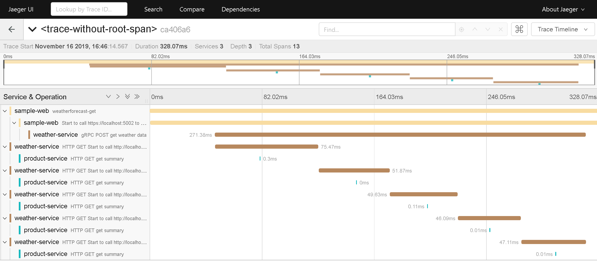

# Opentelemetry Experiment with .NET Core 3.x

[](http://opentelemetry.io)

This is a demo to show how to use OpenTelemetry for tracing on multiple services with multi-protocols on .NET Core 3.x

# Demo scenario

1. SampleWeb (REST)
2. WeatherService (gRPC)
3. ProductService (REST)

### Step 1:

```
$ docker-compose up
```

### Step 2:

Then run 3 projects above with Visual Studio or Visual Code

### Step 3: Run `SampleWeb` with url as below

[http://localhost:<port>/WeatherForecast](http://localhost:<port>/WeatherForecast)

## Jaeger UI

REST -> gRPC -> REST

[http://localhost:16686](http://localhost:16686/)



## Seq UI

[http://localhost:5340](http://localhost:5340/)

